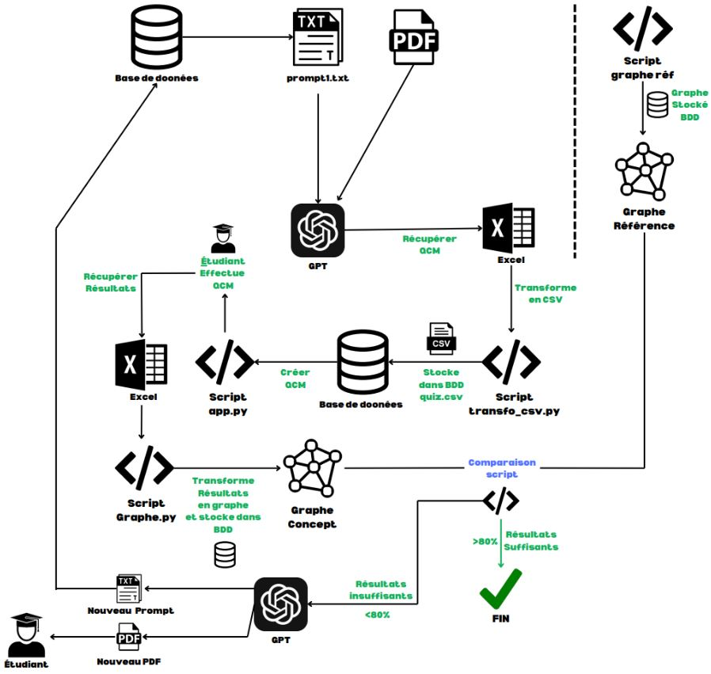
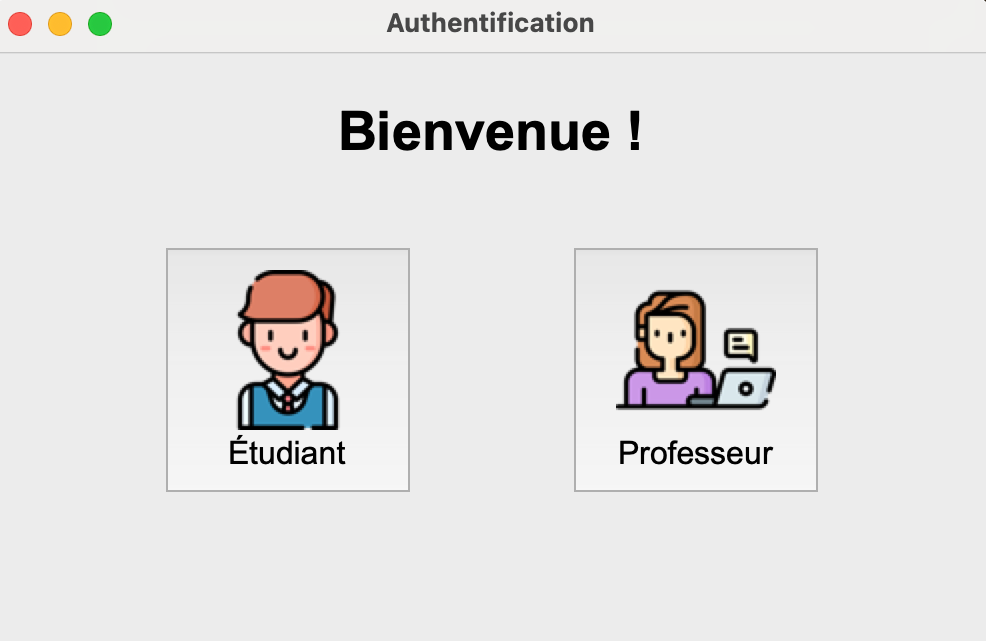

# 2024-m2cns-rd-iot-llm4EducativeEnv

# Membres du Groupe
* Ricardo FERNANDES DIAS ([@rizoricardo](https://github.com/rizoricardo))
* Moise BIAKO ([@skeeters1234](https://github.com/skeeters1234))

## L’Étude des environnements éducatifs intelligents 

## Abstract
Dans le domaine de l’éducation, la diversité des capacités des élèves crée des défis uniques en termes de compréhension et de concentration. Ce projet explore l’utilisation des grands modèles de langage (LLMs) pour améliorer l’expérience éducative des étudiants en proposant des contenus pédagogiques adaptés à leurs besoins. L’objectif est de mettre en œuvre un environnement intelligent efficace qui favorise la personnalisation et la création d’un parcours pédagogique sur mesure pour chaque étudiant. L’un des principaux défis de cette approche réside dans la représentation des connaissances cognitives des étudiants et dans la personnalisation du contenu éducatif généré par les LLM. Pour valider cette approche, nous avons mené une expérimentation sur un échantillon représentatif d’étudiants en générant des QCM basés sur un matière de leur cursus. Les résultats obtenus sont satisfaisants et ils ouvrent des perspectives prometteuses pour l’élaboration d’un agent capable d’accompagner les étudiants tout au long de leur cursus en s’adaptant de manière dynamique.

## Démo vidéo
Vous trouverez ici la démo du fonctionnement de notre projet : [https://www.youtube.com/watch?v=5zMA5jqDOx0](https://www.youtube.com/watch?v=5zMA5jqDOx0)

## Rapport
Vous trouverez ici le rapport du projet : [nom.pdf](route).

## Présentation
Les Slides de la présentation se trouvent ici : [presentation_rd.pdf](docs/presentation_rd.pdf).

## Implémentation
### Schéma de la solution



# Projet Python - Guide d'installation

Ce fichier vous guidera dans les étapes nécessaires pour installer et exécuter ce projet correctement.

## Prérequis

- **Python** : Assurez-vous d'avoir Python installé (version 3.7 ou plus recommandée).
- **Git** : Si vous clonez le projet depuis un dépôt GitHub.

## Étapes d'installation

1. **Clonez le dépôt** (si applicable) :
   ```bash
   git clone <url-du-depot>
   cd <nom-du-depot>
   ```

2. **Créez un environnement virtuel :**
   
   Sous Windows :
   ```bash
   python -m venv .venv
   ```
   Sous macOS/Linux :
   ```bash
   python3 -m venv .venv
   ```

3. **Activez l'environnement virtuel :**
   
   Sous Windows :
   ```bash
   .venv\Scripts\activate
   ```
   Sous macOS/Linux :
   ```bash
   source .venv/bin/activate
   ```

4. **Placez tous les fichiers nécessaires dans le répertoire racine du projet :**
   Assurez-vous que tous les fichiers requis pour le projet sont dans le même répertoire que l'environnement virtuel.

5. **Lancez le script principal :**
   
   Pour exécuter le projet, lancez le fichier `auth.py` avec la commande suivante :
   ```bash
   python auth.py
   ```

## Interface d'accueil

Voici un aperçu de l'interface d'accueil une fois le projet lancé :


